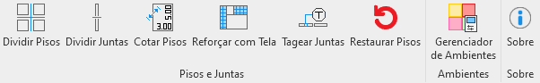

# LPE

The purpose of this Revit Addin is to help the design of a structural floors project.
The first 6 buttons in the "Pisos e Juntas" panel allows the user to split some floors base on the design of lines or stractural framing.
The button int the "Ambientes" panel is a tool to manage some keyschedules in the models, providing agility to the modelling and confiability to the data.

You must build the Revit.Installer project to get the .exe file that will install the solution to run it in Revit 2022, 2023 or 2024.

